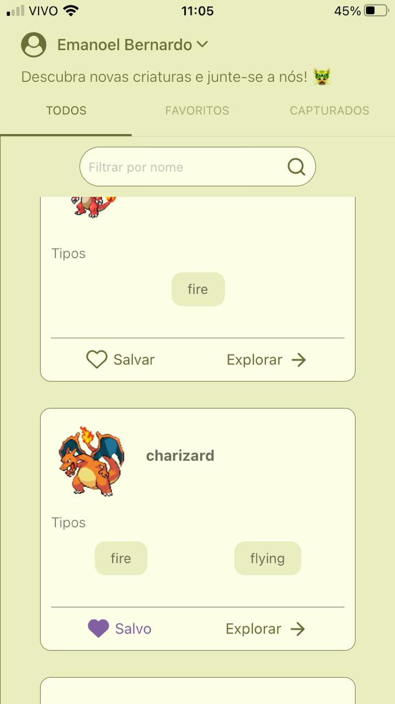
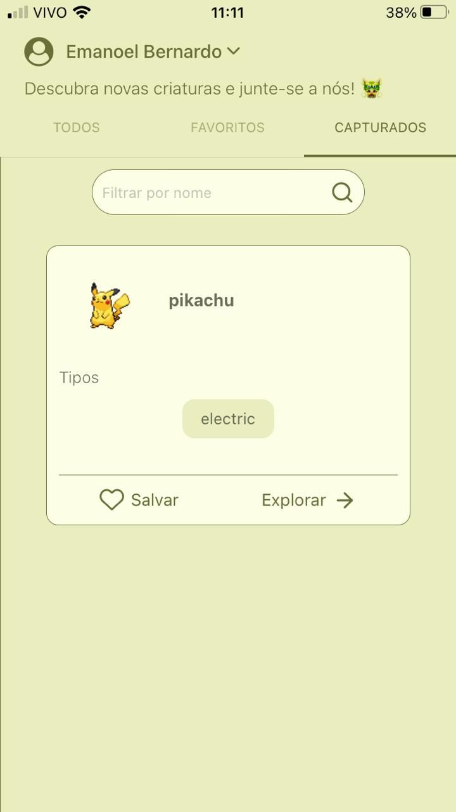

# Pokemon APP
    npm i
    npm start

Este Projeto foi criado usando o Expo Cli consumindo a [Pokeapi](https://pokeapi.co).

## Signup
    Insira seu nome, idade e sexo e prossiga.

## Pokes
    Agore explore e descubra as criaturas, podendo salvar os seus favoritos e capturar os mais fortes 🐱‍🐉.

### Save Pokes
    Veja seus pokemons favoritos ❤

### Capture Pokes
    Achou um pokemon incrível? capture-o

    Tudo pronto ;)
]

    